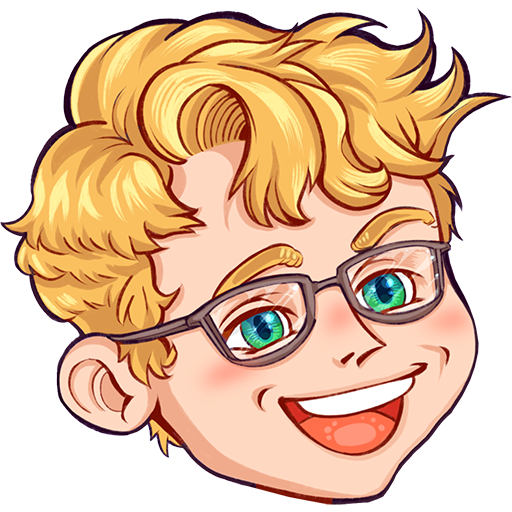

<p align="center">
  <a href="https://www.cuppajojo.com" target="_blank">
    
  </a>
</p>
<h1 align="center">
  <a href="https://www.cuppajojo.com" target="_blank">
    CuppaJoJo.com
  </a>
</h1>

## 🚀 Quick start

1.  **Clone the repo.**

    ```shell
    git clone git@github.com:j0sh77/cuppajojo.com.git
    cd cuppajojo.com
    yarn install
    ```

2.  **Set up a new environmental variable `.env` file.**

    Navigate into your new site’s directory and start it up.

    ```shell
    cp .env.example .env
    ```

3.  **Get a YouTube API key.**

    Check out this YouTube video on how: https://www.youtube.com/watch?v=44OBOSBd73M
    Plug this value into your `.env` file.

    ```
    YOUTUBE_API_KEY="..."
    ```

4.  **Get a Twitch API key.**

    Navigate to https://dev.twitch.tv/console/apps/create and create a new application.
    Find your Client ID and Client Secret.
    Plug these values into your `.env` file.

    ```
    TWITCH_CLIENT_ID = "..."
    TWITCH_CLIENT_SECRET = "..."
    ```

5.  **Start developing.**

    Navigate into your new site’s directory and start it up.

    ```shell
    yarn develop
    ```

6.  **Open the code and start customizing!**

    Your site is now running at http://localhost:8000!

7.  **Learn more**

    - [Documentation](https://www.gatsbyjs.com/docs/?utm_source=starter&utm_medium=readme&utm_campaign=minimal-starter-ts)

    - [Tutorials](https://www.gatsbyjs.com/tutorial/?utm_source=starter&utm_medium=readme&utm_campaign=minimal-starter-ts)

    - [Guides](https://www.gatsbyjs.com/tutorial/?utm_source=starter&utm_medium=readme&utm_campaign=minimal-starter-ts)

    - [API Reference](https://www.gatsbyjs.com/docs/api-reference/?utm_source=starter&utm_medium=readme&utm_campaign=minimal-starter-ts)

    - [Plugin Library](https://www.gatsbyjs.com/plugins?utm_source=starter&utm_medium=readme&utm_campaign=minimal-starter-ts)

    - [Cheat Sheet](https://www.gatsbyjs.com/docs/cheat-sheet/?utm_source=starter&utm_medium=readme&utm_campaign=minimal-starter-ts)

## Important Files

### `./config/socials.json`

This is the file that contains all social media and/or redirects needed on the home page. 

```
{
  "name": "Twitch",
  "icon": "twitch",
  "path": "/twitch",
  "redirect": "https://www.twitch.tv/CuppaJoJo_"
},
```

### `./config/youtube-video-groups.json`

This is the file that contains all groupings for YouTube videos. This is used to create category pages and floating content within the site.

```
{
  "icon": "mario-spin",
  "tags": [
    "super-mario-odyssey",
    "super mario odyssey",
    "supermarioodyssey",
    "smo"
  ],
  "id": "smo",
  "name": "Super Mario Odyssey"
},
```